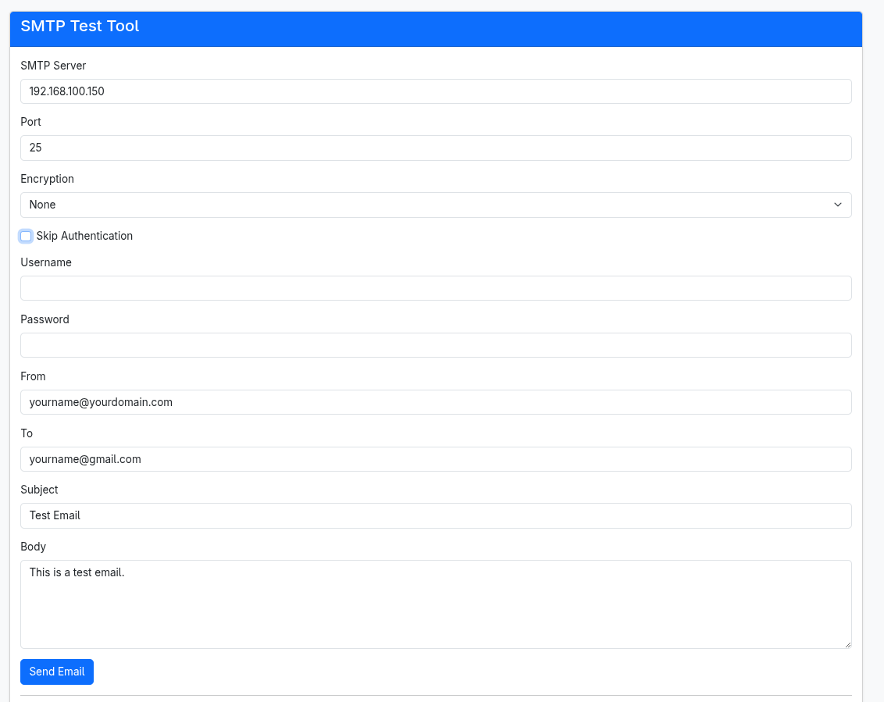
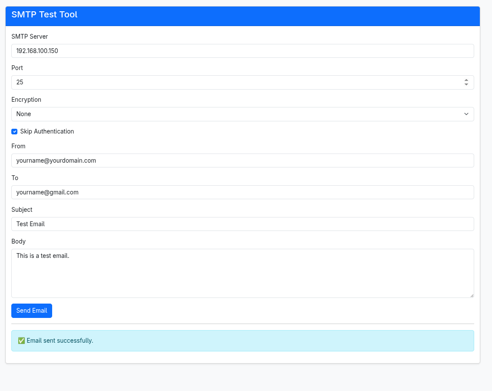

# SMTP Web Tester

A simple web-based SMTP testing tool built in Python (Flask). Useful for quickly testing SMTP connectivity, sending test emails, and debugging mail server setups.



## Features

✅ Beautiful Bootstrap 5 UI  
✅ Supports:
- No encryption
- STARTTLS
- SSL/TLS
✅ Optional SMTP authentication  
✅ Shows high-level error messages  
✅ Retains form data after sending  
✅ Runs easily in Docker  
✅ SMTP connection logs visible in console for debugging

## How to Run Locally

First, install Flask:

```bash
pip install flask
```

Then run the app:

```bash
python smtp_tester_web.py
```

Open your browser at:

```
http://localhost:8080
```

## How to Run with Docker

Build the Docker image:

```bash
docker build -t tayyabtahir/smtp-server .
```

Run the container:

```bash
docker run -d --name smtp-server -p 8080:8080 --restart always tayyabtahir/smtp-server
```

Run the container with docker compose:

```
version: "3.8"

services:
  smtp-server:
    image: tayyabtahir/smtp-server
    container_name: smtp-server
    ports:
      - "8080:8080"
    restart: always
```

```
docker compose up -d
```

Then access it at:

```
http://localhost:8080
```

## Environment

- Python 3.11+
- Flask

## Example Usage

- Test internal mail relays.
- Check SMTP authentication for cloud services.
- Diagnose mail server issues (wrong ports, TLS errors, auth failures).

## Screenshots



## License

MIT License

---

Made with ❤️ by [Tayyab Tahir](https://github.com/tayyabtahir143)
